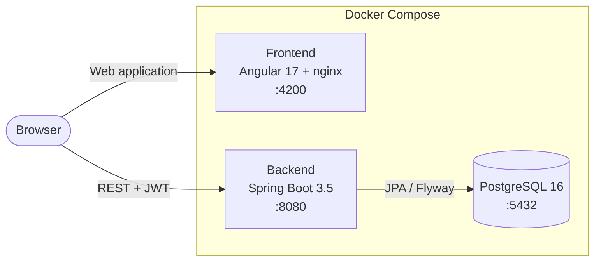

<div align="center">

# 🤖 TaskAI Optimizer

**AI-powered task management that tells you what to work on next and which tasks are about to slip.**

[](https://www.java.com/)
[](https://spring.io/projects/spring-boot)
[](https://angular.dev/)
[](https://www.postgresql.org/)
[](https://www.docker.com/)
[](https://jwt.io/)

</div>

---

## 📖 Overview

Traditional task-management tools such as Trello, Asana or Todoist are effective for organizing tasks, but they do not necessarily help users **decide what to work on first** or **anticipate potential delays**.

**TaskAI Optimizer** adds an intelligent decision-support layer on top of classic task management.

For each task, the system evaluates:

* priority;
* current status;
* deadline proximity;
* delay risk;
* user behaviour;
* estimated completion duration;
* probability of delay;
* predicted completion date.

The system then ranks tasks, recommends the next task to work on and explains the reasoning behind each recommendation.

> **Important:** TaskAI Optimizer does not currently use a trained Machine Learning model. Its AI engine is based on transparent weighted rules combined with statistical user-behaviour analysis. Advanced Machine Learning is part of the project roadmap.

---

## ✨ Features

### 🔐 Authentication & Authorization

* JWT-based authentication.
* User registration and login.
* Password hashing.
* Role-based access control.
* Three roles:

  * `ADMIN`
  * `MANAGER`
  * `USER`
* `MANAGER` currently has notification-related access.
* Task and AI features are currently available to `ADMIN` and `USER`.

### 📋 Task Management

* Create, read, update and delete tasks.
* Task statuses:

  * `TODO`
  * `IN_PROGRESS`
  * `DONE`
* Task priorities:

  * `LOW`
  * `MEDIUM`
  * `HIGH`
* Deadline management.
* Task assignment.
* Automatic tracking of:

  * start time;
  * completion time;
  * actual duration.

### 🧠 AI Analysis

For each task, the AI engine can calculate:

* priority score;
* static risk score;
* predictive risk;
* delay probability;
* completion probability;
* confidence level;
* predicted completion date;
* final combined score.

### 🎯 Explainable Recommendations

The system can:

* identify the next best task;
* rank open tasks;
* provide a top-N recommendation list;
* explain why a task has been recommended.

Recommendations include a readable summary and a list of reasons generated in French.

### 🔔 Smart Notifications

The application provides notifications for task-related events, including intelligent alerts such as:

* recommended action;
* workload overload;
* task creation;
* task updates.

### 📊 Analytics Dashboard

The dashboard provides information about:

* tasks by status;
* high-priority tasks;
* overdue tasks;
* workload level;
* current AI recommendation.

### 👨‍💼 Administration

Administrators can manage application users through the dedicated administration area.

### 📝 Audit Trail

Important task-related actions are recorded through an audit log.

### 🐳 Dockerized Deployment

The complete application can be started using Docker Compose with:

* PostgreSQL;
* Spring Boot backend;
* Angular frontend;
* nginx.

---

## 🧠 How the AI Engine Works

TaskAI Optimizer uses a transparent multi-step scoring and prediction pipeline.

| Step | Component                    | Description                                                                                                                          |
| ---- | ---------------------------- | ------------------------------------------------------------------------------------------------------------------------------------ |
| 1    | `PriorityRules`              | Calculates a priority score from task priority, status and deadline proximity.                                                       |
| 2    | `RiskRules`                  | Calculates a static risk score using deadline, status, priority and assignment information.                                          |
| 3    | `UserBehaviorLearningEngine` | Builds a statistical profile from completed tasks, including average completion time, on-time rate, overdue rate and speed category. |
| 4    | `PredictiveRiskEngine`       | Estimates completion duration, predicted completion date, delay probability and completion probability.                              |
| 5    | `TaskScoringEngine`          | Combines priority and risk into a final score and classifies the task as `LOW`, `MEDIUM` or `HIGH`.                                  |
| 6    | `TaskRankingEngine`          | Sorts open tasks according to their combined score.                                                                                  |
| 7    | `TaskRecommendationEngine`   | Selects the most relevant task and generates top-N recommendations.                                                                  |
| 8    | `ExplainabilityEngine`       | Converts calculated values into understandable summaries and reasons.                                                                |

### Priority Score

The priority score is calculated from:

```text
Priority Score =
    Priority Weight
    + Status Weight
    + Deadline Proximity Weight
```

The current priority weights are:

```text
HIGH priority       = 50
MEDIUM priority     = 30
LOW priority        = 10

TODO                = 20
IN_PROGRESS         = 10

Overdue             = 30
Deadline < 1 day    = 25
Deadline < 3 days   = 15
Deadline < 7 days   = 5
```

### Static Risk

The static risk combines deadline pressure, task state, priority and assignment information.

Examples of deadline risk:

```text
Overdue             = 60
Deadline < 1 day    = 35
Deadline < 3 days   = 20
```

An additional risk is applied when a task is not assigned.

### User Behaviour Profile

The `UserBehaviorLearningEngine` builds a profile using the user's completed tasks.

The profile includes:

* average completion duration;
* on-time completion rate;
* overdue rate;
* speed category.

Speed categories are currently defined as:

```text
FAST       <= 12 hours
NORMAL     <= 36 hours
SLOW       > 36 hours
```

### Predictive Risk

The `PredictiveRiskEngine` estimates task duration using:

```text
40% priority-based baseline
60% user historical behaviour
```

The estimation is then adjusted according to task status and user speed.

The engine derives:

* predicted completion date;
* delay probability;
* completion probability;
* confidence level.

Current confidence:

```text
At least 5 completed tasks = 82%
Fewer than 5 completed tasks = 60%
```

### Final Risk and Combined Score

The final risk is calculated using:

```text
Risk = 55% Static Risk + 45% Predictive Risk
```

The final task score is:

```text
Combined Score = 65% Priority + 35% Risk
```

The resulting level is:

```text
HIGH    >= 70
MEDIUM  >= 40
LOW     < 40
```

This approach makes the current AI engine transparent and explainable while providing a foundation for future Machine Learning models.

---

## 🏗️ Architecture



### Backend Architecture

The backend follows a layered architecture:

```text
Controller
    ↓
Service
    ↓
Repository
    ↓
Entity
```

The backend also uses:

* DTOs;
* mappers;
* Spring Security;
* JWT authentication;
* role-based authorization;
* global exception handling;
* Flyway database migrations.

---

## 🛠️ Technology Stack

| Layer    | Technologies                                                                                                         |
| -------- | -------------------------------------------------------------------------------------------------------------------- |
| Frontend | Angular 17, Standalone Components, Bootstrap 5, Bootstrap Icons, Chart.js, ng2-charts, ngx-toastr, SweetAlert2, RxJS |
| Backend  | Java 17, Spring Boot 3.5, Spring Web, Spring Data JPA, Spring Security, Bean Validation, Lombok                      |
| Security | JWT, stateless authentication, role-based authorization, password hashing                                            |
| Database | PostgreSQL 16, Flyway migrations                                                                                     |
| DevOps   | Docker, Docker Compose, multi-stage builds, nginx                                                                    |

---

## 📁 Project Structure

```text
taskai-optimizer/
│
├── docker-compose.yml
├── .env.example
├── .gitignore
│
├── taskai-backend/
│   ├── Dockerfile
│   ├── pom.xml
│   └── src/
│       ├── main/
│       │   ├── java/com/taskai/optimizer/
│       │   │   ├── ai/
│       │   │   │   ├── engine/
│       │   │   │   ├── model/
│       │   │   │   └── rules/
│       │   │   ├── config/
│       │   │   ├── controller/
│       │   │   ├── dto/
│       │   │   ├── entity/
│       │   │   ├── enums/
│       │   │   ├── exception/
│       │   │   ├── mapper/
│       │   │   ├── repository/
│       │   │   ├── security/
│       │   │   ├── services/
│       │   │   └── util/
│       │   │
│       │   └── resources/
│       │       ├── application.properties
│       │       └── db/migration/
│       │
│       └── test/
│
└── taskai-frontend/
    ├── Dockerfile
    ├── nginx.conf
    ├── package.json
    └── src/
        └── app/
            ├── core/
            ├── features/
            │   ├── admin/
            │   ├── ai-insights/
            │   ├── analytics/
            │   ├── auth/
            │   ├── dashboard/
            │   ├── notifications/
            │   └── tasks/
            └── layout/
```

---

## 🚀 Getting Started

## Option 1 — Docker (Recommended)

### Prerequisites

You need:

* Git;
* Docker Desktop with Docker Compose v2.

### 1. Clone the repository

```bash
git clone https://github.com/aziz11414/taskai-optimizer.git
cd taskai-optimizer
```

### 2. Create the environment file

#### Windows CMD

```cmd
copy .env.example .env
```

#### PowerShell / Linux / macOS

```bash
cp .env.example .env
```

### 3. Configure `.env`

Open `.env` and configure your local values:

```env
POSTGRES_DB=taskai_optimizer_db
POSTGRES_USER=postgres
POSTGRES_PASSWORD=choose_a_strong_password

SERVER_PORT=8080
SPRING_JPA_HIBERNATE_DDL_AUTO=update

APP_JWT_SECRET=replace_with_a_long_random_secret_at_least_32_characters
APP_JWT_EXPIRATION=86400000
```

> ⚠️ Never commit `.env` to GitHub. The `.env` file is excluded by `.gitignore`.

Docker Compose automatically loads `.env` and passes the required values to the containers.

### 4. Start the application

```bash
docker compose up --build
```

The application will start the three services:

| Service     | URL                       |
| ----------- | ------------------------- |
| Frontend    | http://localhost:4200     |
| Backend API | http://localhost:8080/api |
| PostgreSQL  | localhost:5432            |

### 5. Stop the application

```bash
docker compose down
```

To stop the containers and delete the PostgreSQL volume:

```bash
docker compose down -v
```

> ⚠️ Removing the volume permanently deletes the local database data.

---

## Option 2 — Run Without Docker

### Prerequisites

* Java 17;
* Node.js 18.13+ or 20+;
* PostgreSQL 16.

Create a PostgreSQL database named:

```text
taskai_optimizer_db
```

Configure the required database and JWT environment variables before starting the backend.

> Tip: Docker can still be used to run only PostgreSQL:
>
> ```bash
> docker compose up postgres
> ```

### Backend

#### Windows

```cmd
cd taskai-backend
mvnw.cmd spring-boot:run
```

#### Linux / macOS

```bash
cd taskai-backend
./mvnw spring-boot:run
```

Flyway applies the database migrations during application startup.

### Frontend

```bash
cd taskai-frontend
npm install --legacy-peer-deps
npm start
```

The frontend uses the following API URL by default:

```text
http://localhost:8080/api
```

The API URL can be configured through:

```text
taskai-frontend/src/environments/environment.ts
```

---

## 👤 Default Administrator

For development and demonstration purposes, the application initializes an administrator account:

| Field    | Value             |
| -------- | ----------------- |
| Email    | `admin@gmail.com` |
| Password | `admin123`        |
| Role     | `ADMIN`           |

> ⚠️ This account is intended for demonstration/development only. Change or remove the default credentials before any real deployment.

---

## ⚙️ Configuration

| Variable                        | Required | Default                                                | Description                  |
| ------------------------------- | -------: | ------------------------------------------------------ | ---------------------------- |
| `POSTGRES_DB`                   |      Yes | —                                                      | PostgreSQL database name     |
| `POSTGRES_USER`                 |      Yes | —                                                      | PostgreSQL username          |
| `POSTGRES_PASSWORD`             |      Yes | —                                                      | PostgreSQL password          |
| `APP_JWT_SECRET`                |      Yes | —                                                      | JWT signing key              |
| `APP_JWT_EXPIRATION`            |       No | `86400000`                                             | JWT lifetime in milliseconds |
| `SPRING_DATASOURCE_URL`         |       No | `jdbc:postgresql://localhost:5432/taskai_optimizer_db` | JDBC database URL            |
| `SPRING_DATASOURCE_USERNAME`    |       No | `postgres`                                             | Database username            |
| `SPRING_DATASOURCE_PASSWORD`    |       No | —                                                      | Database password            |
| `SPRING_JPA_HIBERNATE_DDL_AUTO` |       No | `none`                                                 | Hibernate schema mode        |
| `SERVER_PORT`                   |       No | `8080`                                                 | Backend server port          |

### CORS

The backend currently allows:

```text
http://localhost:4200
```

The CORS configuration can be found in:

```text
taskai-backend/src/main/java/com/taskai/optimizer/config/CorsConfig.java
```

If the frontend is deployed to another domain, update the allowed origin accordingly.

---

## 🔌 API Reference

All protected endpoints require:

```http
Authorization: Bearer <JWT_TOKEN>
```

### Authentication

| Method | Endpoint             | Access |
| ------ | -------------------- | ------ |
| `POST` | `/api/auth/register` | Public |
| `POST` | `/api/auth/login`    | Public |

### Tasks

| Method   | Endpoint          | Access          |
| -------- | ----------------- | --------------- |
| `POST`   | `/api/tasks`      | `ADMIN`, `USER` |
| `GET`    | `/api/tasks`      | `ADMIN`, `USER` |
| `GET`    | `/api/tasks/{id}` | `ADMIN`, `USER` |
| `PUT`    | `/api/tasks/{id}` | `ADMIN`, `USER` |
| `DELETE` | `/api/tasks/{id}` | `ADMIN`         |

### Users

| Method   | Endpoint          | Access  |
| -------- | ----------------- | ------- |
| `GET`    | `/api/users`      | `ADMIN` |
| `POST`   | `/api/users`      | `ADMIN` |
| `GET`    | `/api/users/{id}` | `ADMIN` |
| `PUT`    | `/api/users/{id}` | `ADMIN` |
| `DELETE` | `/api/users/{id}` | `ADMIN` |

### AI

| Method | Endpoint                                | Description                   |
| ------ | --------------------------------------- | ----------------------------- |
| `GET`  | `/api/ai/tasks/{id}/analyze`            | Analyze a task                |
| `GET`  | `/api/ai/tasks/recommendation`          | Get the next recommended task |
| `GET`  | `/api/ai/tasks/recommendations?limit=5` | Get top-N recommendations     |

The recommendation endpoint supports a maximum of 10 results.

### Analytics

```text
GET /api/analytics/tasks
GET /api/analytics/my-tasks
GET /api/analytics/dashboard
```

### Notifications

| Method   | Endpoint                          | Access                     |
| -------- | --------------------------------- | -------------------------- |
| `GET`    | `/api/notifications`              | `ADMIN`, `USER`, `MANAGER` |
| `GET`    | `/api/notifications/unread-count` | `ADMIN`, `USER`, `MANAGER` |
| `PUT`    | `/api/notifications/{id}/read`    | `ADMIN`, `USER`, `MANAGER` |
| `PUT`    | `/api/notifications/read-all`     | `ADMIN`, `USER`, `MANAGER` |
| `DELETE` | `/api/notifications/{id}`         | `ADMIN`, `USER`, `MANAGER` |
| `POST`   | `/api/notifications`              | `ADMIN`                    |

---

## 🧪 API Example

### Login

```bash
curl -X POST http://localhost:8080/api/auth/login \
  -H "Content-Type: application/json" \
  -d '{"email":"admin@gmail.com","password":"admin123"}'
```

The response contains a JWT token.

### Request the next recommended task

```bash
curl http://localhost:8080/api/ai/tasks/recommendation \
  -H "Authorization: Bearer <JWT_TOKEN>"
```

### Request top-N recommendations

```bash
curl "http://localhost:8080/api/ai/tasks/recommendations?limit=5" \
  -H "Authorization: Bearer <JWT_TOKEN>"
```

---

## 🔒 Security

TaskAI Optimizer implements several security mechanisms:

* **JWT authentication** using stateless sessions.
* JWT tokens are sent through the `Authorization: Bearer` header.
* JWT expiration is configurable.
* **Role-based authorization** using Spring Security and `@PreAuthorize`.
* Frontend route protection using Angular guards.
* Password hashing instead of plaintext password storage.
* Sensitive configuration values are provided through environment variables.
* `.env` is excluded from Git through `.gitignore`.
* Only `.env.example` with placeholder values is committed.
* CORS is restricted to the configured frontend origin.

### Security recommendations

Before a real deployment:

* replace the default administrator credentials;
* use a strong random JWT secret;
* use a strong PostgreSQL password;
* configure HTTPS;
* configure the production frontend origin in CORS;
* avoid exposing database ports publicly;
* review authorization rules before production deployment.

> ⚠️ The project is an academic/development application and should undergo additional security review before production use.

---

## 🖼️ Screenshots

Screenshots can be stored in:

```text
docs/screenshots/
```

Recommended screenshots include:

* Dashboard;
* Task list;
* Task details;
* AI Insights;
* Analytics;
* Notifications;
* Administration.

Example:

```markdown

```

---

## 🗺️ Roadmap

The current rule-based AI engine provides a foundation for future improvements.

* [ ] Advanced Machine Learning models for delay prediction
* [ ] Model training and evaluation
* [ ] Hyperparameter tuning
* [ ] Improved prediction accuracy
* [ ] Team collaboration
* [ ] Shared projects
* [ ] Advanced task assignment optimization
* [ ] Mobile application for iOS / Android
* [ ] Interactive OpenAPI / Swagger documentation
* [ ] Advanced workload optimization

---

## 👥 Authors

* **Mohamed Aziz Hammami** — [@aziz11414](https://github.com/aziz11414)
* **Houssem Soltani**

---

## 🎓 Academic Project

**TaskAI Optimizer — 2026**

Final-year academic project focused on:

* intelligent task management;
* explainable task recommendations;
* predictive task-risk analysis;
* user behaviour analysis;
* modern web application architecture;
* containerized deployment.

---

<div align="center">

**Built with Angular, Spring Boot, PostgreSQL and Docker.**

</div>
