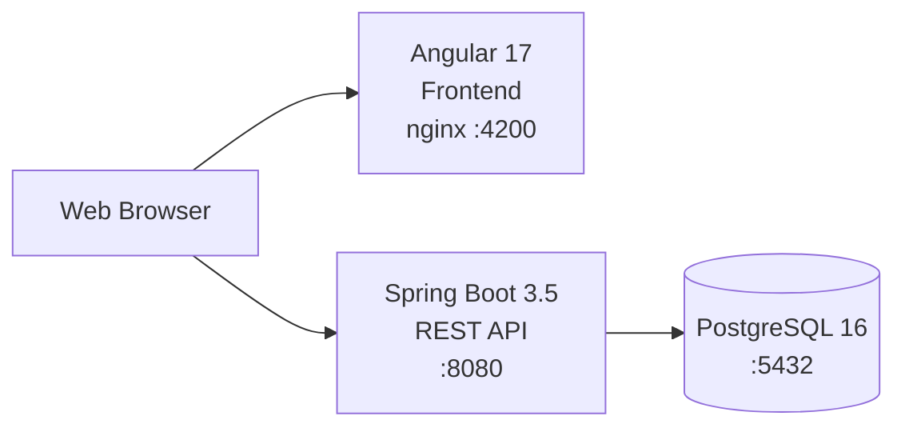
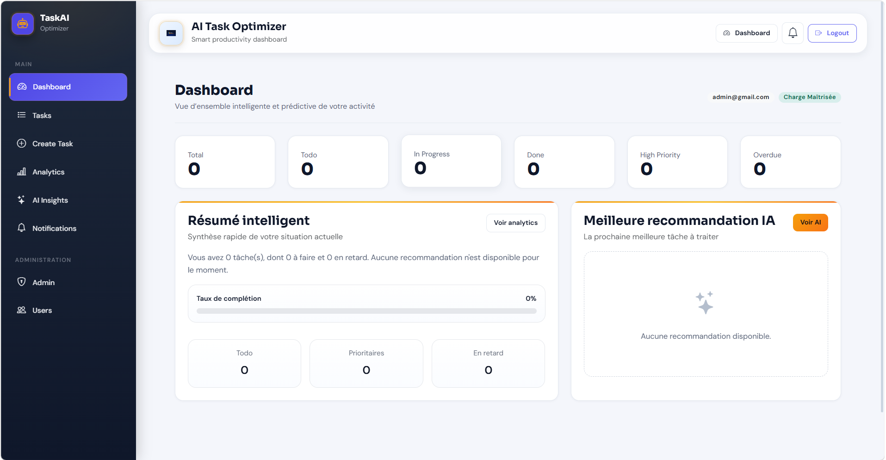
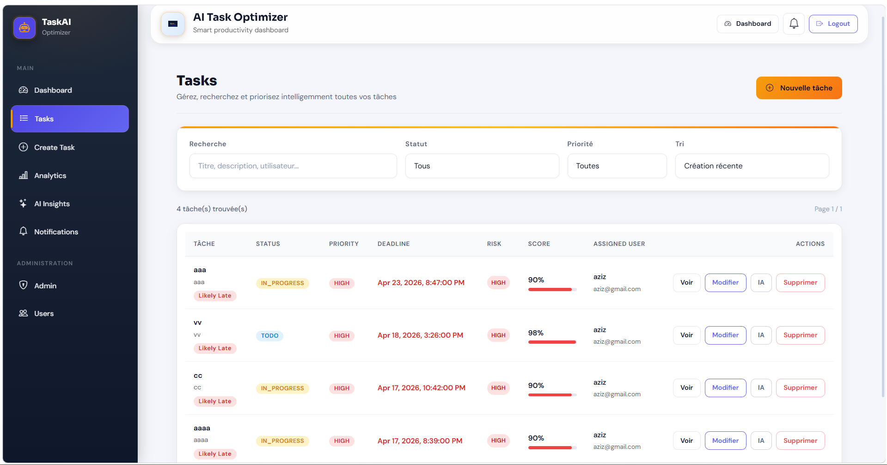
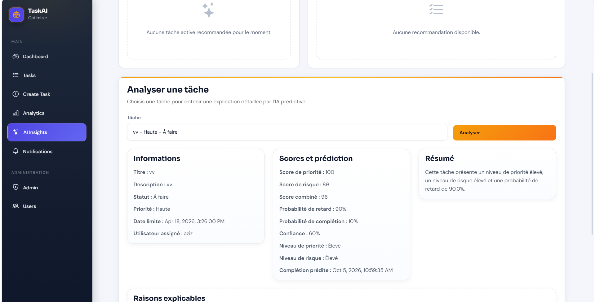
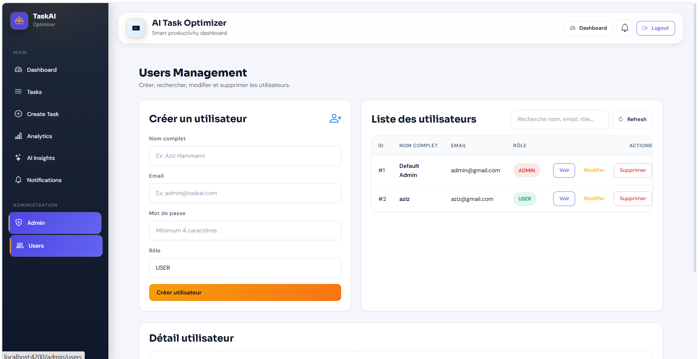

# TaskAI Optimizer

TaskAI Optimizer is a web-based task management application that combines conventional task management with an explainable decision-support engine.

The application evaluates task priority, deadline proximity, task status and user behaviour in order to estimate task risk, rank pending tasks and recommend which task should be addressed next.

The current intelligent engine is based on weighted business rules and statistical analysis of user behaviour. It is **not based on a trained Machine Learning model**. Advanced Machine Learning is planned as a future evolution of the project.

---

## Table of Contents

* [Overview](#overview)
* [Objectives](#objectives)
* [Main Features](#main-features)
* [Intelligent Decision Engine](#intelligent-decision-engine)
* [Application Architecture](#application-architecture)
* [Technology Stack](#technology-stack)
* [Project Structure](#project-structure)
* [Requirements](#requirements)
* [Installation](#installation)

  * [Docker Deployment](#docker-deployment)
  * [Local Development](#local-development)
* [Configuration](#configuration)
* [Authentication and Authorization](#authentication-and-authorization)
* [API Reference](#api-reference)
* [Database and Migrations](#database-and-migrations)
* [Security](#security)
* [Screenshots](#screenshots)
* [Project Limitations](#project-limitations)
* [Roadmap](#roadmap)
* [Authors](#authors)
* [Academic Context](#academic-context)
* [License](#license)

---

## Overview

Traditional task management applications mainly focus on creating, organizing and monitoring tasks.

TaskAI Optimizer extends this approach by introducing an intelligent decision-support layer capable of analysing the current state of tasks and user behaviour.

For each task, the system can evaluate:

* task priority;
* task status;
* deadline proximity;
* assignment status;
* static risk;
* historical user performance;
* estimated completion duration;
* predicted completion date;
* probability of delay;
* confidence level.

The resulting information is used to rank tasks and generate recommendations.

The objective is not to replace the user in decision-making, but to provide a transparent mechanism that helps identify which task deserves attention first.

---

## Objectives

The main objectives of TaskAI Optimizer are:

1. Provide a complete task management platform.
2. Implement authentication and role-based authorization.
3. Monitor task status, priority and deadlines.
4. Analyse historical user behaviour.
5. Estimate the risk associated with pending tasks.
6. Predict potential completion delays.
7. Rank tasks according to a combined priority and risk score.
8. Provide explainable recommendations.
9. Provide dashboards and analytics.
10. Provide a containerized development and deployment environment.

---

# Main Features

## Authentication and User Management

The application provides:

* user registration;
* user authentication;
* JWT-based sessions;
* password hashing;
* role-based authorization;
* user administration.

Three roles are currently defined:

| Role      | Description                              |
| --------- | ---------------------------------------- |
| `ADMIN`   | Full administrative access               |
| `MANAGER` | Notification-related access              |
| `USER`    | Task management and intelligent analysis |

The exact permissions are enforced by the backend through Spring Security.

---

## Task Management

Users can manage tasks containing information such as:

* title;
* description;
* status;
* priority;
* deadline;
* assigned user;
* start date;
* completion date;
* actual completion duration.

Available task statuses:

```text
TODO
IN_PROGRESS
DONE
```

Available priority levels:

```text
LOW
MEDIUM
HIGH
```

---

## Intelligent Task Analysis

The intelligent engine analyses individual tasks and calculates:

* priority score;
* static risk;
* predictive risk;
* final risk;
* combined score;
* risk level;
* predicted completion date;
* delay probability;
* completion probability;
* confidence level;
* explanation of the result.

---

## Task Recommendations

The application can:

* identify the most relevant pending task;
* rank pending tasks;
* return a configurable number of recommendations;
* explain the factors that influenced the recommendation.

The recommendation system is designed to remain understandable rather than functioning as a black box.

---

## Notifications

The notification module provides users with task-related information, including:

* task events;
* recommendations;
* workload-related information;
* updates.

Notifications can be read individually or collectively.

---

## Analytics

The application provides analytical information about task activity, including:

* task distribution by status;
* task priorities;
* pending work;
* completed work;
* overdue tasks;
* workload information.

---

## Administration

Administrators have access to dedicated user-management functionality.

Administrative operations are protected by backend authorization rules.

---

## Audit Logging

The backend contains an audit mechanism for recording relevant application actions.

---

# Intelligent Decision Engine

The intelligent module is implemented as a sequence of independent components.

```text
Task
 │
 ├── PriorityRules
 │
 ├── RiskRules
 │
 ├── UserBehaviorLearningEngine
 │
 ├── PredictiveRiskEngine
 │
 ├── TaskScoringEngine
 │
 ├── TaskRankingEngine
 │
 ├── TaskRecommendationEngine
 │
 └── ExplainabilityEngine
```

## 1. Priority Analysis

The priority engine calculates a score based on:

* task priority;
* current status;
* deadline proximity.

Current weights are:

| Factor                | Value |
| --------------------- | ----: |
| HIGH priority         |    50 |
| MEDIUM priority       |    30 |
| LOW priority          |    10 |
| TODO                  |    20 |
| IN_PROGRESS           |    10 |
| Overdue               |    30 |
| Deadline below 1 day  |    25 |
| Deadline below 3 days |    15 |
| Deadline below 7 days |     5 |

The priority score is therefore based on the combination of these factors.

---

## 2. Static Risk Analysis

The static risk engine evaluates factors such as:

* deadline;
* task status;
* priority;
* assignment.

Current deadline-related risk values include:

| Condition             | Risk |
| --------------------- | ---: |
| Overdue               |   60 |
| Deadline below 1 day  |   35 |
| Deadline below 3 days |   20 |

An additional risk contribution is applied when a task is not assigned.

---

## 3. User Behaviour Analysis

The `UserBehaviorLearningEngine` analyses previously completed tasks.

The user profile contains information such as:

* average completion duration;
* on-time completion rate;
* overdue completion rate;
* execution speed.

The current speed categories are:

| Category | Completion time |
| -------- | --------------: |
| FAST     |     <= 12 hours |
| NORMAL   |     <= 36 hours |
| SLOW     |      > 36 hours |

This historical information is used by the predictive engine.

---

## 4. Predictive Risk

The `PredictiveRiskEngine` estimates the expected completion duration using:

```text
40% priority-based baseline
60% historical user behaviour
```

The result is adjusted according to the current task status and user speed.

The engine can produce:

* expected duration;
* predicted completion date;
* delay probability;
* completion probability;
* confidence level.

The current confidence rules are:

```text
5 or more completed tasks: 82%
Fewer than 5 completed tasks: 60%
```

These values represent the current project rules and are **not statistical confidence intervals produced by a trained Machine Learning model**.

---

## 5. Final Risk

The final risk combines static and predictive risk:

```text
Final Risk =
    55% Static Risk
    +
    45% Predictive Risk
```

---

## 6. Combined Task Score

The final task score combines priority and risk:

```text
Combined Score =
    65% Priority
    +
    35% Risk
```

The resulting classification is:

| Score | Level  |
| ----: | ------ |
| >= 70 | HIGH   |
| >= 40 | MEDIUM |
|  < 40 | LOW    |

---

## 7. Ranking and Recommendations

Tasks are ranked according to their combined score.

The recommendation engine can then return:

* the highest-ranked task;
* a list of the top-ranked tasks;
* the reasons behind the recommendation.

---

## 8. Explainability

The system generates explanations based on the factors used during scoring.

Examples of possible factors include:

* approaching deadline;
* high priority;
* overdue status;
* high predicted risk;
* user historical performance;
* task assignment status.

This makes the current decision-support mechanism easier to understand and evaluate.

---

# Application Architecture

TaskAI Optimizer follows a client-server architecture.



## Backend Architecture

The backend follows a layered architecture:

```text
REST Controller
       |
       v
Service Layer
       |
       v
Repository Layer
       |
       v
Entity / Database
```

Additional backend components include:

* DTOs;
* mappers;
* validation;
* exception handling;
* authentication;
* authorization;
* intelligent analysis engines;
* database migrations.

---

# Technology Stack

## Frontend

* Angular 17
* Angular Standalone Components
* Bootstrap 5
* Bootstrap Icons
* Chart.js
* ng2-charts
* ngx-toastr
* SweetAlert2
* RxJS

## Backend

* Java 17
* Spring Boot 3.5
* Spring Web
* Spring Data JPA
* Spring Security
* Jakarta Validation
* Lombok
* JJWT

## Database

* PostgreSQL 16
* Flyway

## Infrastructure

* Docker
* Docker Compose
* nginx
* Multi-stage Docker builds

---

# Project Structure

```text
taskai-optimizer/
│
├── .env.example
├── .gitignore
├── docker-compose.yml
├── README.md
│
├── docs/
│   └── screenshots/
│       ├── login.png
│       ├── dashboard.png
│       ├── tasks.png
│       ├── ai-insights.png
│       └── administration.png
│
├── taskai-backend/
│   ├── Dockerfile
│   ├── pom.xml
│   │
│   └── src/
│       ├── main/
│       │   ├── java/
│       │   │   └── ...
│       │   │
│       │   └── resources/
│       │       ├── application.properties
│       │       └── db/
│       │           └── migration/
│       │
│       └── test/
│
└── taskai-frontend/
    ├── Dockerfile
    ├── nginx.conf
    ├── package.json
    │
    └── src/
        └── app/
            ├── core/
            ├── features/
            │   ├── admin/
            │   ├── ai-insights/
            │   ├── analytics/
            │   ├── auth/
            │   ├── dashboard/
            │   ├── notifications/
            │   └── tasks/
            │
            └── layout/
```

---

# Requirements

## Docker Deployment

Recommended requirements:

* Git
* Docker Desktop
* Docker Compose v2

## Local Development

For development without Docker:

* Java 17
* Maven Wrapper included in the project
* Node.js 18.13+ or a compatible modern Node.js version
* npm
* PostgreSQL 16

---

# Installation

## Docker Deployment

Docker Compose is the recommended way to run the complete application.

### 1. Clone the repository

```bash
git clone https://github.com/aziz11414/taskai-optimizer.git
cd taskai-optimizer
```

### 2. Create the environment file

#### Windows CMD

```cmd
copy .env.example .env
```

#### PowerShell

```powershell
Copy-Item .env.example .env
```

#### Linux / macOS

```bash
cp .env.example .env
```

### 3. Configure `.env`

Example:

```env
POSTGRES_DB=taskai_optimizer_db
POSTGRES_USER=postgres
POSTGRES_PASSWORD=change_me

SERVER_PORT=8080
SPRING_JPA_HIBERNATE_DDL_AUTO=update

APP_JWT_SECRET=change_me_to_a_long_random_secret_at_least_32_characters
APP_JWT_EXPIRATION=86400000
```

The `.env` file is intended for local configuration and **must not be committed to the repository**.

### 4. Start the application

```bash
docker compose up --build
```

The application will expose:

| Component   | Address                     |
| ----------- | --------------------------- |
| Frontend    | `http://localhost:4200`     |
| Backend API | `http://localhost:8080/api` |
| PostgreSQL  | `localhost:5432`            |

### 5. Stop the application

```bash
docker compose down
```

To remove the database volume as well:

```bash
docker compose down -v
```

> Removing the volume deletes the local PostgreSQL data.

---

# Local Development

## Backend

From the project root:

```bash
cd taskai-backend
```

### Windows

```cmd
mvnw.cmd spring-boot:run
```

### Linux / macOS

```bash
./mvnw spring-boot:run
```

The backend starts by default on:

```text
http://localhost:8080
```

The REST API is available under:

```text
http://localhost:8080/api
```

---

## Frontend

From the project root:

```bash
cd taskai-frontend
npm install --legacy-peer-deps
npm start
```

The Angular application is available at:

```text
http://localhost:4200
```

---

# Configuration

The backend reads its configuration through environment variables.

| Variable                        | Required | Default                                                | Description                      |
| ------------------------------- | -------- | ------------------------------------------------------ | -------------------------------- |
| `POSTGRES_DB`                   | Yes      | —                                                      | PostgreSQL database name         |
| `POSTGRES_USER`                 | Yes      | —                                                      | PostgreSQL username              |
| `POSTGRES_PASSWORD`             | Yes      | —                                                      | PostgreSQL password              |
| `APP_JWT_SECRET`                | Yes      | —                                                      | JWT signing secret               |
| `APP_JWT_EXPIRATION`            | No       | `86400000`                                             | JWT expiration in milliseconds   |
| `SPRING_DATASOURCE_URL`         | No       | `jdbc:postgresql://localhost:5432/taskai_optimizer_db` | PostgreSQL JDBC URL              |
| `SPRING_DATASOURCE_USERNAME`    | No       | `postgres`                                             | PostgreSQL username              |
| `SPRING_DATASOURCE_PASSWORD`    | No       | —                                                      | PostgreSQL password              |
| `SPRING_JPA_HIBERNATE_DDL_AUTO` | No       | `none`                                                 | Hibernate schema generation mode |
| `SERVER_PORT`                   | No       | `8080`                                                 | Spring Boot HTTP port            |

## Example `.env.example`

The repository should contain only placeholder values:

```env
POSTGRES_DB=taskai_optimizer_db
POSTGRES_USER=postgres
POSTGRES_PASSWORD=change_me

SERVER_PORT=8080
SPRING_JPA_HIBERNATE_DDL_AUTO=update

APP_JWT_SECRET=change_me_to_a_long_random_secret_at_least_32_characters
APP_JWT_EXPIRATION=86400000
```

The real `.env` file should remain local.

---

# Default Administrator Account

For development and demonstration purposes, the project provides a default administrator account:

```text
Email:    admin@gmail.com
Password: admin123
Role:     ADMIN
```

This account is intended only for demonstration or local development.

For any real deployment, the default credentials must be changed or removed.

---

# Authentication and Authorization

The application uses JWT-based stateless authentication.

The general authentication flow is:

```text
User
 |
 | Login
 v
Authentication API
 |
 | JWT
 v
Frontend
 |
 | Authorization: Bearer <token>
 v
Protected API
 |
 v
Spring Security
 |
 v
Authorized Resource
```

Authorization is enforced by the backend.

The frontend also uses route guards to prevent unauthorized navigation, but frontend protection is **not considered a replacement for backend authorization**.

---

# API Reference

The backend exposes a REST API under:

```text
/api
```

Protected endpoints require:

```http
Authorization: Bearer <JWT_TOKEN>
```

## Authentication

| Method | Endpoint             | Access |
| ------ | -------------------- | ------ |
| POST   | `/api/auth/register` | Public |
| POST   | `/api/auth/login`    | Public |

---

## Tasks

| Method | Endpoint          | Access          |
| ------ | ----------------- | --------------- |
| POST   | `/api/tasks`      | `ADMIN`, `USER` |
| GET    | `/api/tasks`      | `ADMIN`, `USER` |
| GET    | `/api/tasks/{id}` | `ADMIN`, `USER` |
| PUT    | `/api/tasks/{id}` | `ADMIN`, `USER` |
| DELETE | `/api/tasks/{id}` | `ADMIN`         |

---

## Users

| Method | Endpoint          | Access  |
| ------ | ----------------- | ------- |
| GET    | `/api/users`      | `ADMIN` |
| GET    | `/api/users/{id}` | `ADMIN` |
| POST   | `/api/users`      | `ADMIN` |
| PUT    | `/api/users/{id}` | `ADMIN` |
| DELETE | `/api/users/{id}` | `ADMIN` |

---

## Artificial Intelligence

| Method | Endpoint                                | Description                    |
| ------ | --------------------------------------- | ------------------------------ |
| GET    | `/api/ai/tasks/{id}/analyze`            | Analyse a task                 |
| GET    | `/api/ai/tasks/recommendation`          | Return the recommended task    |
| GET    | `/api/ai/tasks/recommendations?limit=5` | Return the top recommendations |

The recommendation limit is configurable within the supported range of the backend.

---

## Analytics

The analytics module provides task-related statistics through dedicated endpoints.

Examples:

```text
GET /api/analytics/tasks
GET /api/analytics/my-tasks
GET /api/analytics/dashboard
```

---

## Notifications

| Method | Endpoint                          | Access                     |
| ------ | --------------------------------- | -------------------------- |
| GET    | `/api/notifications`              | `ADMIN`, `USER`, `MANAGER` |
| GET    | `/api/notifications/unread-count` | `ADMIN`, `USER`, `MANAGER` |
| PUT    | `/api/notifications/{id}/read`    | `ADMIN`, `USER`, `MANAGER` |
| PUT    | `/api/notifications/read-all`     | `ADMIN`, `USER`, `MANAGER` |
| DELETE | `/api/notifications/{id}`         | `ADMIN`, `USER`, `MANAGER` |
| POST   | `/api/notifications`              | `ADMIN`                    |

---

# API Usage Example

## Login

```bash
curl -X POST http://localhost:8080/api/auth/login \
  -H "Content-Type: application/json" \
  -d '{"email":"admin@gmail.com","password":"admin123"}'
```

The authentication response provides a JWT token.

## Request Task Recommendation

```bash
curl http://localhost:8080/api/ai/tasks/recommendation \
  -H "Authorization: Bearer <JWT_TOKEN>"
```

## Request Multiple Recommendations

```bash
curl "http://localhost:8080/api/ai/tasks/recommendations?limit=5" \
  -H "Authorization: Bearer <JWT_TOKEN>"
```

---

# Database and Migrations

The application uses PostgreSQL 16 as its relational database.

Database schema evolution is handled through Flyway.

Migration files are located under:

```text
taskai-backend/src/main/resources/db/migration/
```

Flyway applies migrations automatically when the Spring Boot application starts.

The project uses migrations to maintain a controlled and reproducible database schema.

---

# Security

The project implements several security mechanisms:

* JWT authentication;
* stateless sessions;
* Spring Security;
* role-based authorization;
* method-level authorization;
* password hashing;
* frontend route guards;
* environment-based secrets;
* Git exclusion of `.env`;
* restricted CORS configuration.

Sensitive values should never be stored directly in source code.

The repository therefore uses:

```text
.env
```

for local secrets and:

```text
.env.example
```

for documented placeholders.

The `.env` file is excluded through `.gitignore`.

---

## Production Security Considerations

Before deploying the application in a production environment, the following points should be addressed:

* replace the default administrator credentials;
* generate a strong random JWT secret;
* use HTTPS;
* configure a production frontend origin;
* review CORS configuration;
* restrict database network access;
* review all role-based authorization rules;
* configure secure database credentials;
* avoid exposing PostgreSQL directly to the public network;
* perform a complete application security audit.

TaskAI Optimizer is an academic project and should not be considered production-ready without additional security validation.

---

# Screenshots

## Login


## Dashboard



## Task Management



## AI Insights



## Administration



---

# Project Limitations

The current version has several intentional limitations.

## Intelligent Engine

The current AI engine is rule-based and statistical.

It does not currently contain:

* a trained Machine Learning model;
* neural networks;
* reinforcement learning;
* automated model training;
* large-scale historical datasets.

The current implementation provides a foundation for future Machine Learning experimentation.

## Prediction Accuracy

Prediction quality depends on the amount and quality of historical task data available for each user.

Users with limited task history receive less personalized predictions.

## Deployment

The current configuration is primarily designed for local development and academic demonstration.

Production deployment requires additional infrastructure and security configuration.

---

# Roadmap

Future development may include:

* [ ] Advanced Machine Learning for completion-time prediction
* [ ] Automated model training
* [ ] Model evaluation and comparison
* [ ] Hyperparameter optimization
* [ ] Improved delay prediction
* [ ] Advanced workload optimization
* [ ] Team collaboration
* [ ] Shared projects
* [ ] Intelligent task assignment
* [ ] Mobile application
* [ ] OpenAPI / Swagger documentation
* [ ] Advanced monitoring and observability
* [ ] Production deployment configuration

---

# Authors

**Mohamed Aziz Hammami**

GitHub: `@aziz11414`

**Houssem Soltani**

---

# Academic Context

**TaskAI Optimizer** was developed as a final-year academic project in 2026.

The project combines:

* web application development;
* software architecture;
* task management;
* authentication and authorization;
* database management;
* statistical user behaviour analysis;
* explainable decision support;
* predictive task-risk analysis;
* containerized application deployment.

The project is intended to demonstrate the design and implementation of a complete modern web application while exploring the integration of intelligent decision-support mechanisms into task management.

---

# License

This project was developed for academic purposes.

If the project is later distributed publicly under a specific open-source license, this section should be updated accordingly.
